# Kingbbode Spring Boot Chatbot

[](https://jitpack.io/#kingbbode/spring-boot-chatbot)

스프링 부트 기반 대화형 챗봇 서포트 프레임워크!

- Spring Framework 기반
- 1:1 대화형 제공
- 개발하기 쉬운(?) 인터페이스 제공

## 제공 Starter Pack

- chatbot-spring-boot-slack-starter
- chatbot-spring-boot-line-starter
- chatbot-spring-boot-telegram-starter
- chatbot-spring-boot-teamup-starter

## Release Notes

### 0.4.6

- Slack RTM Server `GOODBYE` Event 대응

---

# 소개

## echo example


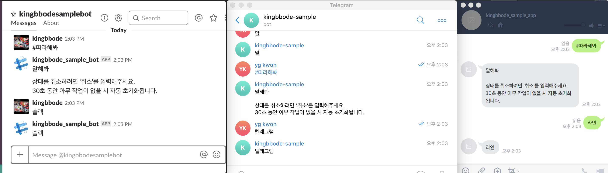

```java
@Brain
public class FirstBrain {

    @BrainCell(key = "따라해봐", function = "echo-start")
    public String echo(BrainRequest brainRequest) {
        return  "말해봐";
    }

    @BrainCell(function = "echo-end", parent = "echo-start")
    public String echo2(BrainRequest brainRequest) {
        return  brainRequest.getContent();
    }
}
```

### @Brain

`@Brain` 은 Spring Framework 의 `@Controller` 와 같은 역할을 합니다.

봇의 기능의 탐색을 위한 Bean 등록을 위한 어노테이션입니다.

### @BrainCell

`@BrainCell` 은 Spring Framework 의 `@RequestMapping` 과 같은 역할을 합니다.

봇의 기능을 나타내는 어노테이션입니다.

#### @BrainCell 속성

- key : 명령어입니다.
- function : 고유 key 입니다.
- parent : 부모 기능을 나타냅니다. parent 가 있을 시 1단계 명령어로는 등록되지 않고, 부모 기능의 다음 명령어로 동작합니다.

#### 대화형 기능 작성

단계적인 기능 접근 기능입니다. 예를 들어 최상위 기능으로 `A` 와 `B` 가 있고 `C`가 `A`의 자식일 경우, 첫 명령어로는 `A` 와 `B`만 노출되며, `C`는 `A` 명령어 이후로만 실행 됩니다.

- key가 없는 자식은 모든 텍스트 메시지를 받습니다.

```java
@BrainCell(function = "echo-end", parent = "echo-start")
public String echo2(BrainRequest brainRequest) {
    return  brainRequest.getContent();
}
```
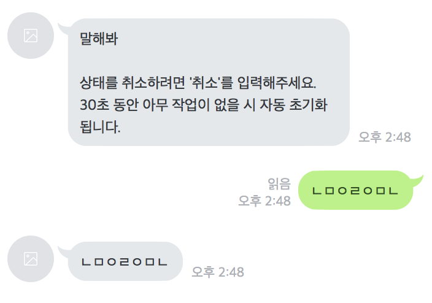

- 자식들에게 key가 있을 때는 자식의 key로만 동작합니다.

```java
@BrainCell(function = "echo-end-1", key= "조회" parent = "echo-start")
public String echo2(BrainRequest brainRequest) {
    return  brainRequest.getContent();
}

@BrainCell(function = "echo-end-2", key= "저장" parent = "echo-start")
public String echo2(BrainRequest brainRequest) {
    return  brainRequest.getContent();
}
```

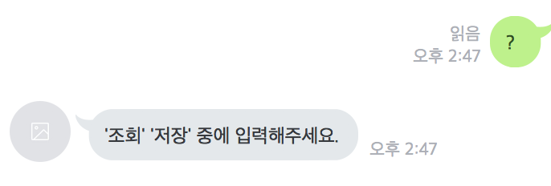

- 대화는 명령어 사용 유저와 1:1 로 작동합니다. 다른 유저와는 독립적으로 동작합니다 (다른 유저가 명령어 중간에 끼어들 수 없음)

## 1 어플리케이션 3 메신저 통합 가능

### Gradle

```
dependencies {
    compile 'com.github.kingbbode.spring-boot-chatbot:chatbot-spring-boot-slack-starter:{version}'
    compile 'com.github.kingbbode.spring-boot-chatbot:chatbot-spring-boot-line-starter:{version}'
    compile 'com.github.kingbbode.spring-boot-chatbot:chatbot-spring-boot-telegram-starter:{version}'
}
```

3가지 메신저에서 하나의 챗봇이 동작 할 수 있습니다.


---

# 연동 

## Gradle

```
allprojects {
	repositories {
		...
		maven { url 'https://jitpack.io' }
	}
}
```

```
dependencies {
    compile 'com.github.kingbbode:{select starter pack}:{version}'
}
```

## Properties

```java
# CHAT-BOT
chatbot.name = default # 내부적으로 사용되는 챗봇 고유 이름
chatbot.base-package = # Brain Scan Package.
chatbot.enabled = true # 챗봇 활성화 여부
chatbot.enableBase = true # 기본 기능 사용 여부 (#기능 : 기능 목록 출력)
chatbot.enableKnowledge = true # 학습 기능 사용 여부 (심심이 같은 기능)

# Redis (default Embeded Redis)
chatbot.hostName = localhost
chatbot.port = 6879
chatbot.timeout = 0
chatbot.password = # password
chatbot.usePool = true
chatbot.useSsl = false
chatbot.db-index = 0
chatbot.client-name = # clientName
chatbot.convert-pipeline-and-tx-results = true

# Command
chatbot.command-prefix = "#" # 커맨드 접두어 설정. 
```

## Slack Starter

### Gradle

```
dependencies {
    compile 'com.github.kingbbode.spring-boot-chatbot:chatbot-spring-boot-slack-starter:{version}'
}
```

### Slack Bot 생성 및 토큰 발급

슬랙 앱을 생성합니다.

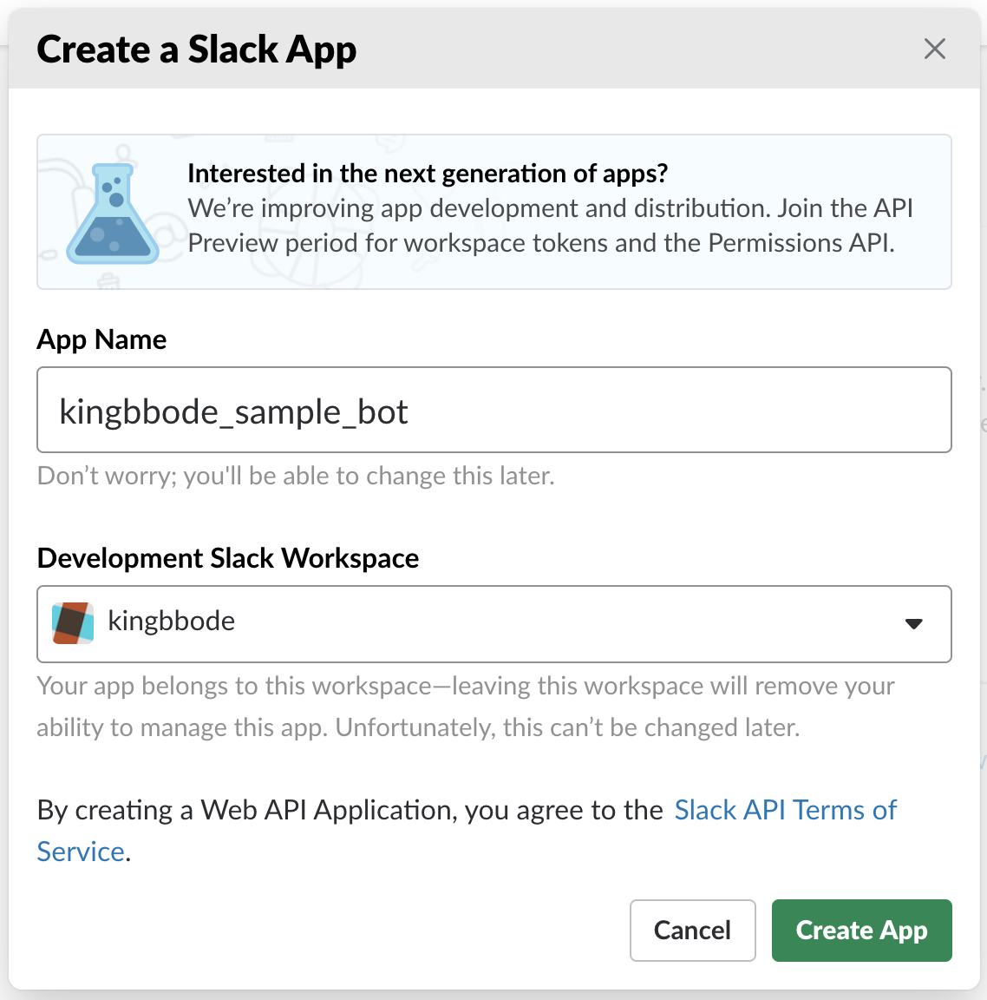

Bot User를 추가합니다.

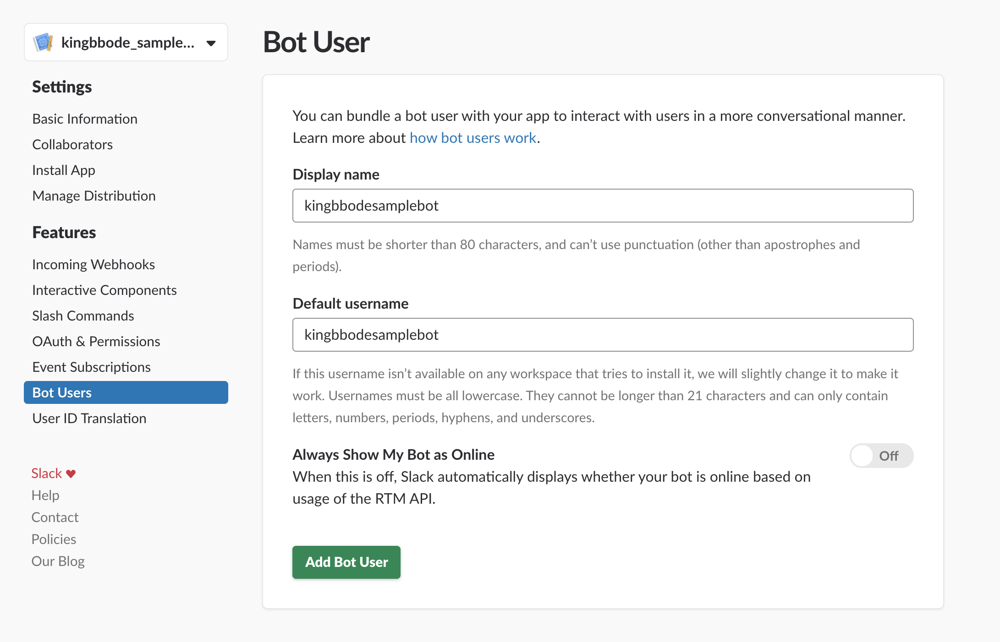

Team 에 App 을 설치합니다.

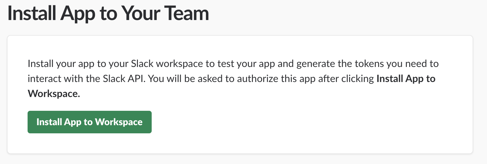

토큰이 발급됩니다.

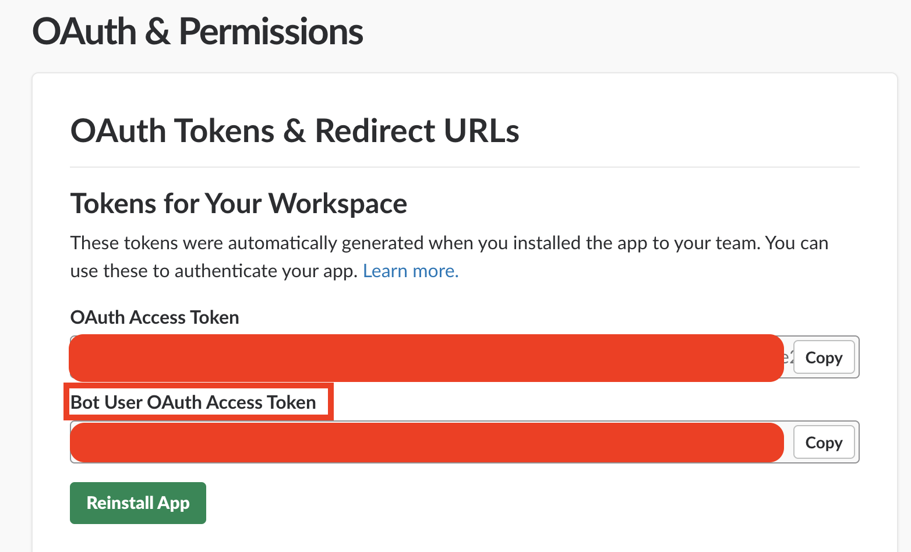

### Properties

발급받은 token을 `application.properties` 혹은 `application.yml` 에 추가합니다.

```
slack:
  token: xxxxx
```

## Line Starter

### Gradle

```
dependencies {
    compile 'com.github.kingbbode.spring-boot-chatbot:chatbot-spring-boot-line-starter:{version}'
}
```

### Line Bot 생성 및 토큰 발급

Line Bot을 생성합니다.

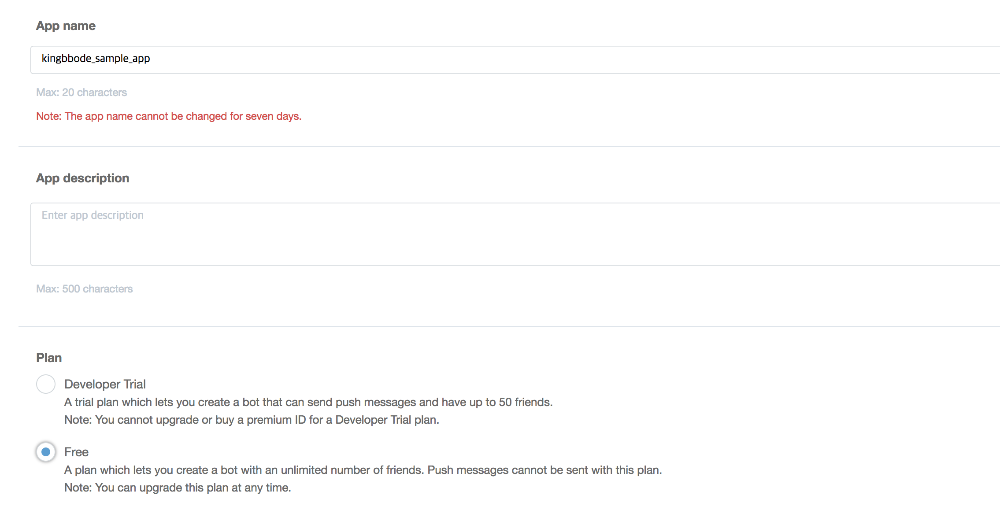

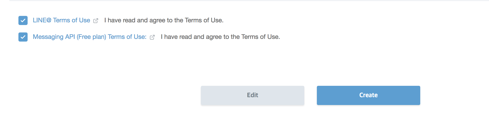

생성된 `secret` 을 기억해둡니다.

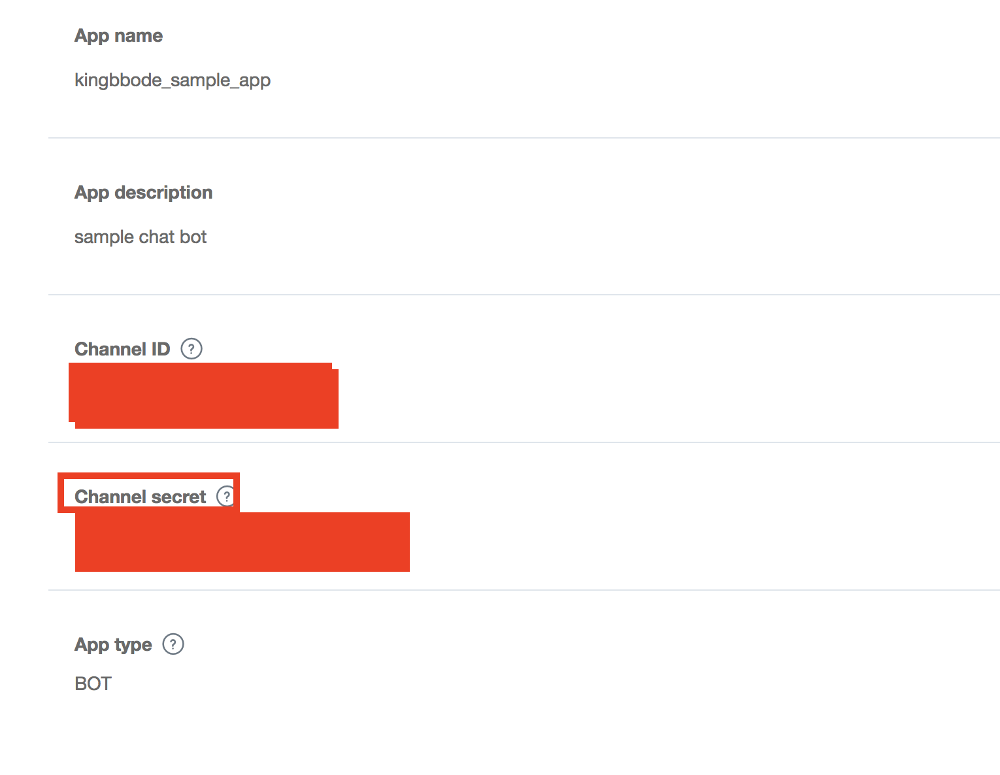

WebHook을 활성화합니다.

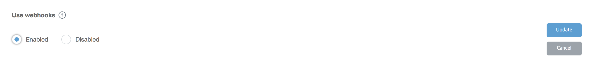

`토큰` 을 생성합니다.

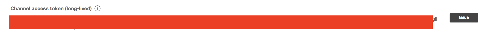

spring boot application `port` 와 연동되는 `callback url`을 등록합니다.

로컬 테스트시 `ngrok` 사용을 추천합니다.

```
ngrok http 8080
```


`callback url` 을 등록합니다.

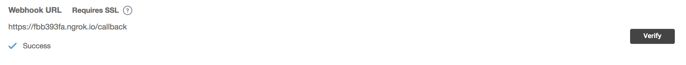

### Properties

발급받은 token 과 secret 을 `application.properties` 혹은 `application.yml` 에 추가합니다.

```
line:
  bot:
    channel-token: xxx
    channel-secret: xxx
```

## Telegram Starter

### Gradle

```
dependencies {
    compile 'com.github.kingbbode.spring-boot-chatbot:chatbot-spring-boot-telegram-starter:{version}'
}
```

### Telegram Bot 생성 및 토큰 발급

BotFather 를 통해 봇을 생성하고 토큰을 발급받습니다.

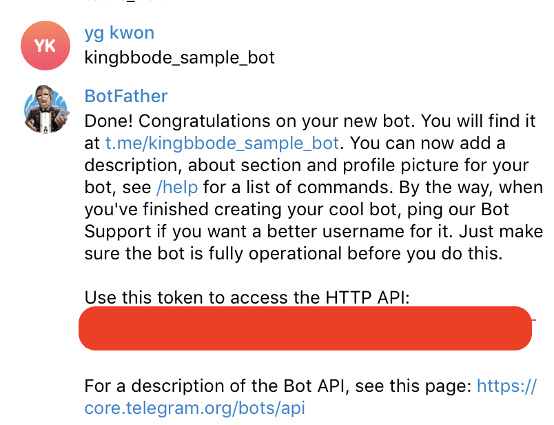

### Properties

발급받은 token 을 `application.properties` 혹은 `application.yml` 에 추가합니다.

```
telegram:
  name: kingbbode-sample
  token: xxx
```

---

## History

1. 첫 프레임워크화
https://github.com/kingbbode/chatbot-framework 

2. starter pack 구성 시작
https://github.com/ultzum/spring-boot-starter-chatbot

3. 현재
https://github.com/kingbbode/spring-boot-chatbot

---

# TODO
- 테스트 코드 작성 ( 폭망..)
- 버전 상향
